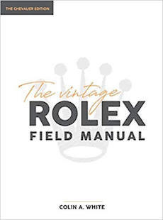

## The Vintage Rolex Field Manual Chevalier Edition
<table>
<tr>
    <th>
        ISBN: 978-0578630823 
        Size: 8.5 x 0.9 x 11 inches 
        Weight: 2.5 lbs 
        Format: Hardcover 
        Publish: 2020 
        

        
        <A href="https://www.amazon.com/Vintage-Rolex-Field-Manual-Collectors/dp/0578630826/">Buy on Amazon</a>
        

    </th>
    <th>
        
    </th>
</tr>
</table>

## The Vintage Rolex Field Guide Classic Edition 
<table>
<tr>
    <th>
        ISBN: 978-0578524801 
        Size: 7.5 x 0.7 x 9.2 inches 
        Weight: 1.3 lbs 
        Format: Paperback 
        Published: 2019 
        

        
        <a href="https://www.amazon.com/dp/0578524805/">Buy on Amazon</a>
        

    </th>
    <th>
        
    </th>
</tr>
</table>

## Rolex Vintage Guía Práctica Edición Clásica En Español
<table>
<tr>
    <th>
        ISBN: 978-0578670508   
        Talla: 7.5 x 0.7 x 9.2 inches   
        Peso: 1.3 lbs   
        Formato: libro de bolsillo 
        Published: 2020 
        

        
        <a href="https://www.amazon.com/Gu%C3%ADa-Pr%C3%A1ctica-Rolex-Vintage-supervivencia/dp/057867050X/">Cómpralo en Amazon </a>
        

    </th>
    <th>
        
    </th>
</tr>
</table>
