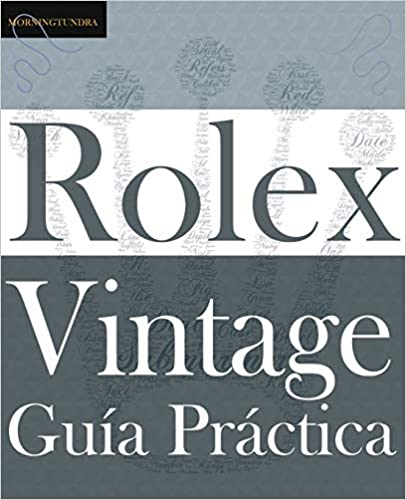

## The Vintage Rolex Field Manual Chevalier Edition
<table>
<tr>
    <th>
        ISBN: 978-0578630823 
        Size: 8.5 x 0.9 x 11 inches 
        Weight: 2.5 lbs 
        Format: Hardcover 
        Published: 2020 
        

        
        <A href="https://www.amazon.com/Vintage-Rolex-Field-Manual-Collectors/dp/0578630826/">Buy on Amazon</a>
        

    </th>
    <th>
        
    </th>
</tr>
</table>

## The Vintage Rolex Field Guide Classic Edition 
<table>
<tr>
    <th>
        ISBN: 978-0578524801 
        Size: 7.5 x 0.7 x 9.2 inches 
        Weight: 1.3 lbs 
        Format: Paperback 
        Published: 2019 
        

        
        <a href="https://www.amazon.com/dp/0578524805/">Buy on Amazon</a>
        

    </th>
    <th>
        
    </th>
</tr>
</table>

## Rolex Vintage Guía Práctica Edición Clásica En Español
<table>
<tr>
    <th>
        ISBN: 978-0578670508   
        Talla: 7.5 x 0.7 x 9.2 inches   
        Peso: 1.3 lbs   
        Formato: libro de bolsillo 
        Published: 2020 
        

        
        <a href="https://www.amazon.com/Gu%C3%ADa-Pr%C3%A1ctica-Rolex-Vintage-supervivencia/dp/057867050X/">Cómpralo en Amazon </a>
        

    </th>
    <th>
        
    </th>
</tr>
</table>

## What's the difference between the GUIDE and the MANUAL?
The *Field Guide* was designed to be a stripped-down, data-first, no-frills survival guide. This smaller sized paperback can be carried to watch fairs and auctions and referenced as needed. There is sufficient 'white space' to write in the margins and take notes.

The *Field Manual* is an expanded version with more contextual information including a detailed look at space-flown Rolex, considerably more photos and in a larger hardcover format. This is a 2lb desk reference in the style of a coffee table book.

Both books are also available in digital EPUB formats which can be purchased from [Apple Bookstore](https://books.apple.com/us/book/the-vintage-rolex-field-guide/id1469475756) and Google Play.