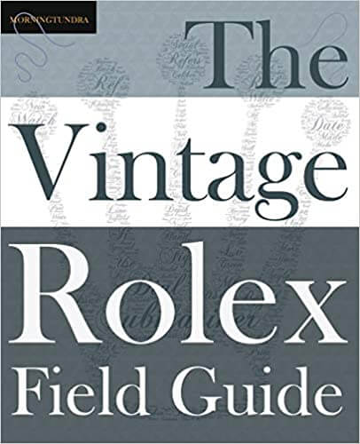
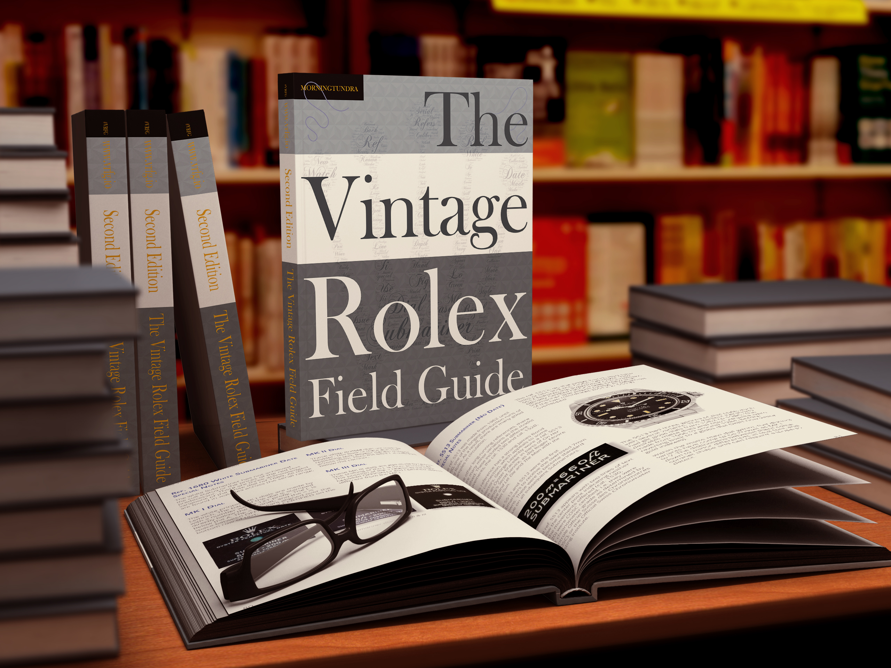
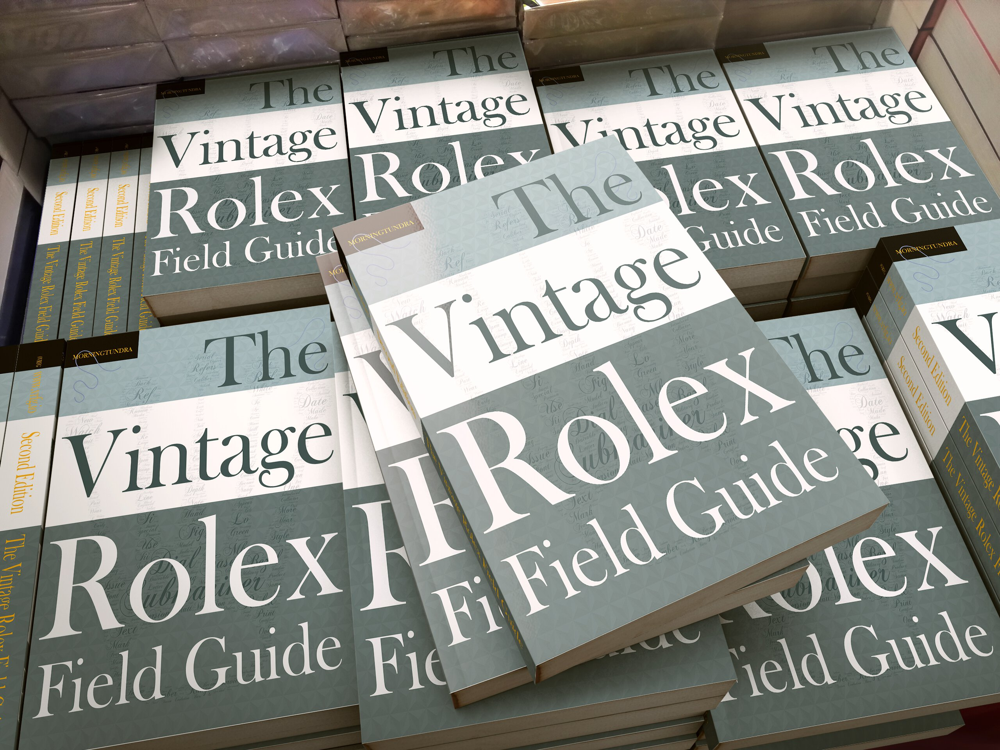
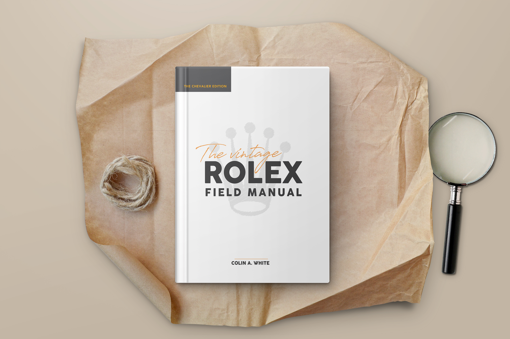
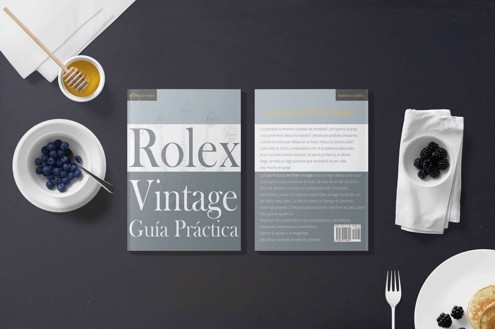

## The Vintage Rolex Field Manual  Chevalier Edition
<table>
<tr>
    <th>
        ISBN: 978-0578630823 
        Size: 8.5 x 0.9 x 11 inches 
        Weight: 2.5 lbs 
        Format: Hardcover 
        Published: 2020 
        
&nbsp;

        

        
        <A href="https://www.amazon.com/Vintage-Rolex-Field-Manual-Collectors/dp/0578630826/">Buy on Amazon</a>
        

    </th>
    <th>
        
    </th>
</tr>
</table>

## The Vintage Rolex Field Guide  Classic Edition 
<table>
<tr>
    <th>
        ISBN: 978-0578524801 
        Size: 7.5 x 0.7 x 9.2 inches 
        Weight: 1.3 lbs 
        Format: Paperback 
        Published: 2019 
        
&nbsp;

        

        
        <a href="https://www.amazon.com/dp/0578524805/">Buy on Amazon</a>
        

    </th>
    <th>
        
    </th>
</tr>
</table>

## Rolex Vintage Guía Práctica  Edición Clásica En Español
<table>
<tr>
    <th>
        ISBN: 978-0578670508   
        Talla: 7.5 x 0.7 x 9.2 inches   
        Peso: 1.3 lbs   
        Formato: libro de bolsillo 
        Published: 2020 
        
&nbsp;

        

        
        <a href="https://www.amazon.com/Gu%C3%ADa-Pr%C3%A1ctica-Rolex-Vintage-supervivencia/dp/057867050X/">Cómpralo en Amazon </a>
        

    </th>
    <th>
        
    </th>
</tr>
</table>

## Where Else Can I Buy These Books?
<table>
<tr>
   <th>&nbsp;</th>
   <th>

</th>
   <th>

</th>
   <th>

</th>
</tr>
<tr>
    <td>Barnes & Nobel</td> 
    <td>
<a href="https://www.barnesandnoble.com/w/the-vintage-rolex-field-manual-colin-a-white/1136954533?ean=9780578630823">✔</a>
</td>
    <td>
<a href="https://www.barnesandnoble.com/w/the-vintage-rolex-field-guide-morningtundra/1132017785?ean=9780578524801">✔</a>
</td>
    <td>
<a href="https://www.barnesandnoble.com/w/gu-a-pr-ctica-del-rolex-vintage-colin-a-white/1136954532?ean=9780578670508">✔</a>
</td>
</tr>
<tr>
    <td>Waterstones</td> 
    <td>
<a href="https://www.waterstones.com/book/the-vintage-rolex-field-manual/colin-a-whte/9780578630823">✔</a>
</td>
    <td>
<a href="https://www.waterstones.com/book/the-vintage-rolex-field-guide/morningtundra/9780578524801">✔</a>
</td>
    <td>
<a href="https://www.waterstones.com/book/guia-practica-del-rolex-vintage/colin-a-whte/9780578670508">✔</a>
</td>
</tr>
<tr>
<td>Wallmart</td>
    <td>
<a href="https://www.walmart.com/ip/Chevalier-The-Vintage-Rolex-Field-Manual-Hardcover-9780578630823/714862291">&#10004;</a>
</td>
    <td>
<a href="https://www.walmart.com/ip/Field-Guides-The-Vintage-Rolex-Field-Guide-Paperback-9780578524801/906349964">&#10004;</a>
</td>
    <td>
<a href="https://www.walmart.com/ip/Classic-Gu-a-Pr-ctica-del-Rolex-Vintage-Un-manual-de-supervivencia-para-la-aventura-del-Rolex-vintage-Paperback-9780578670508/274677974">&#10004;</a>
</td>
</tr>
<tr>
    <td>Adlibris</td>
    <td>
<a href="https://www.adlibris.com/no/bok/the-vintage-rolex-field-manual-9780578630823">✔</a>
</td>
    <td>
<a href="https://www.adlibris.com/no/sok?q=978-0578524801">✔</a>
</td>
    <td>
<a href="https://www.adlibris.com/no/sok?q=978-0578670508">✔</a>
</td> 
</tr>
<tr>
<td>AbeBooks</td>
    <td>
<a href="https://www.abebooks.com/servlet/SearchResults?cm_sp=SearchF-_-topnav-_-Results&ds=20&kn=978-0578630823&sts=t">✔</a>
</td>
    <td>
<a href="https://www.abebooks.com/servlet/SearchResults?cm_sp=SearchF-_-topnav-_-Results&ds=20&kn=978-0578524801&sts=t">✔</a>
</td>
    <td>
<a href="https://www.abebooks.com/servlet/SearchResults?cm_sp=SearchF-_-topnav-_-Results&ds=20&kn=978-0578670508&sts=t">✔</a>
</td> 
</tr>
</table>

If you're on a budget, used copies of these books can also be found on Ebay.

## What's the difference between the GUIDE and the MANUAL?
The *Field Guide* was designed to be a stripped-down, data-first, no-frills survival guide. This smaller sized paperback can be carried to watch fairs and auctions and referenced as needed. There is sufficient 'white space' to write in the margins and take notes.

The *Field Manual* is an expanded version with more contextual information including a detailed look at space-flown Rolex, considerably more photos and in a larger hardcover format. This is a 2lb desk reference in the style of a coffee table book.

Both books are also available in digital EPUB formats which can be purchased from [Apple Bookstore](https://books.apple.com/us/book/the-vintage-rolex-field-guide/id1469475756), the Amazon Kindle Store, and Google Play.

If you want to see the interior of these books, search YouTube for book reviews on these titles.

## Can I resell these books?
If you operate an eCommerce shop or website, the easiest way is to join [Amazon Associates](https://affiliate-program.amazon.com/) and collect a sales commission on any purchases you send to their site. 

If you run a boutique or other retail or pop-up store, you can order a retail carton of nine books at 30% off the cover price. With this you carry your own inventory and set your own price. Email morningtundra@gmail.com for details.

## Merchandise
If you enjoyed any of the illustrations in these books, various merchandise is available from [Redbubble](https://www.redbubble.com/people/nyquist212/explore?asc=u&page=1&sortOrder=recent). From stickers to bed spreads, framed prints to novelty socks -  these make great gifts to accompany the book.

    

        
        
        
    

    

        
        
        
    

## If you'd like to feature or review this book
If you run a website, blog, podcast, or YouTube channel and would to like review these books you are free to use these large format images. If you'd like quotes or comments from the author, you can reach out to me at morningtundra@gmail.com. You can also send me a message on Instagram [@morning_tundra](https://www.instagram.com/morning_tundra/).

    

        
        
    

    

        
        
    

    

        
        
    

## About The Author

[*Colin A. White*](https://amazon.com/author/colinwhite)

A data scientist, software engineer, recovering entrepreneur, and vintage watch enthusiast. Born and raised in the Far East, educated in Britain and now living and working in the USA, he’s traveled the world several times over. His watch-credentials and 40-year track record include buying more bad lemons than good. This has given him direct personal experience of the pitfalls and mistakes that all vintage watch enthusiasts expose themselves too. This work is an effort to pass on his interests and help others walk a successful and joy-filled path to vintage Rolex ownership.

<iframe src="https://aerbook.com/store/VRFM?showheader=false" frameborder="0" style="width:100%;height:1800px;"></iframe>