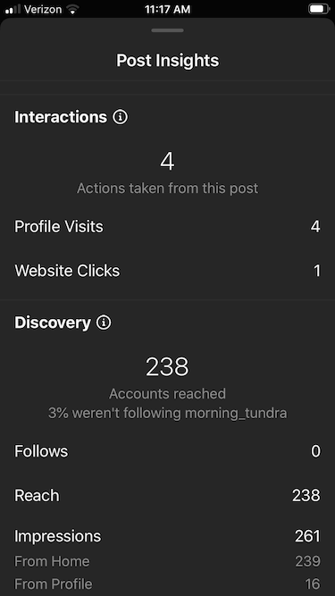
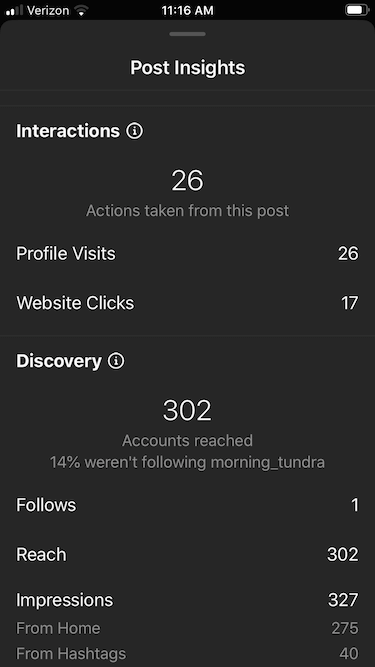

# Instagram Marketing for Apple Bookstore Titles in 2020
The Spring of 2020 turned out to be a sub-optimal time to launch a book. Especially a nerdy, non-fiction reference book for a narrow niche.

My launch-timing was locked-in well before the arrival of COVID19. By the time I knew significant disruption was inevitable, it was too late to reschedule and defuse the demand and expectation I had shamelessly built. I had little choice but to let the dice roll and watch my modest budget go up in smoke, or down in flames, or a damp squib, or... choose your disappointing analogy.

So I found myself with no budget and only a modest amount of time to commit given my increasingly precarious day-job. I could do little but take stock and reevaluated my options. The book was essentially sound having received a warm reception from early reviewers. However I was dead in the water for marketing or advertising. It was clear I would have to pursue some asymmetric, guerrilla campaign if I wanted anyone to know about my work, let alone pay good money for it.

The EPUB (US$30.00) was always a tickler for the hardback print edition and I knew I could discount it and give away as many as I wanted without actually incurring any direct cost. And given the EPUB reading experience, I wasn't worried about it cannibalizing print sales. If anything, it was just a lead magnet.  

I don't mean to dismiss the whole EPUB reading experience. It's just that my book didn't shine in this format due to all the detailed drawings, charts, tables, lists and callout panels. It was designed to be a physical book and presented best that way.

I took inventory of all the assets and resources I had at my disposal. The two things that stood out were my Instagram account [@morning_tundra](https://www.instagram.com/morning_tundra/) with ~1000+ engaged followers, and 250 [free promo codes curtesy of Apple Books](https://itunespartner.apple.com/books/articles/apple-books-promo-codes-2740). It made sense to combine the two somehow.

## Designing a Campaign

I hatched a plan for a marketing campaign that involved giving away promo codes for a free EPUB every day for the first 10 days of August, plus the last two days of July where I broadcast the coming competition and rules. 

*Gameifying* your marketing is a great way to encourage engagement and interaction. Otherwise it's just an ad. And ads are just *sooo* 20th Century. The simplest way to gameify your book marketing is to use a strategy from the playbook of pro copywriters which emphasizes *urgency* and *scarcity*.

I could create urgency by posting on a fixed schedule so interested participants would have to be quick off the mark if they wanted to win. They were up against the clock as well as one another. And with only one code per day, they were certainly scarce.

With some punchy copy, I hoped these posts would convert into downloads. And with some engagement and prompting (shamelessly asking) I could get a few reviews. I decided this would be the ultimate goal and the measure of any success.

In internet marketing parlance this type of campaign is known as 'targeting the bottom of the sales funnel', where audience interest and intent is already validated. They are after all, following me and engaging with my post content.
Any subsequent 'conversion' would be a review as opposed to a sale. 

While the size of my IG following is OK, it's not substantial. I would need to goose the visitor traffic by engaging at 'top of funnel' to generate interest and awareness of my campaign. 

I decided to leverage two other Social Media channels - Reddit and Facebook. I would post additional promo codes to affinity groups referring them my IG feed for further daily opportunities to get more free stuff. The prospect of FREE stuff is a great driver of human behavior.

#### A few important notes on Apple Promo Codes.

* Each book has a limit of 250 codes
* Codes are administered through your iTunes Connect account
* Codes are generated and exported for your promotional use 
* The minimum number of codes you can export is one
* Codes expire after 4 weeks from the date of generation

August is a notoriously quiet part of the business cycle, with all aspects slowing down (and not just in Europe). If you want to set a *performance management baseline* this would be the month to do it. So assessing the performance of any future marketing campaign, August would be the month to compare to.

With things being so quiet, I also felt I didn't have much to lose. If the campaign flopped, few would notice. And if it worked, even modestly, it would be an improvement over sitting out the entire month of August.

I decided to use the same ad image throughout the campaign, in an attempt to achieve some visual consistency across social platforms. And also I wanted to keep my effort to a minimum, as I didn't have a lot of time and my expectations were low. So this is what I came up with.

.jpg)

* The base iPad image was a [free vector template from Vecteezy.com](https://www.vecteezy.com/vector-art/622799-mockup-in-front-of-a-black-tablet-that-looks-realistic-with-a-transparent-blank-screen)

* The iPad content is a cropped screen shot of the EPUB opened in Apple Books.

* The Apple badge comes from the official [Apple Books Style Guide](https://www.apple.com/itunes/marketing-with-apple-books/identity-guidelines.html#the-apple-books-badge).

Any image processing software should be able to combine these three elements (I used Adobe Illustrator). This image was then exported to the [IG Portrait Photo dimensions](https://blog.tailwindapp.com/instagram-image-size-guide-2020/) of 1080 x 1035 pixels (aspect ratio 4:5). This would avoid any awkward cropping or resizing by Instagram after upload.

I then uploaded this image into my free account on Later.com and wrote some IG-friendly copy. Later.com allows you to pre-program and automate all the posts in a campaign, setting it all up once and then leaving it to do its thing. I also used Zapier.com to copy these auto-posts to my Pinterest and FB Page. I don't have much of a following in these channels but when volume is so low, every visitor and view counts.

I reused a variation of this copy for each of the 10 days and made some minor customizations. These included changes to vocabulary, emojis and hashtags. Urban legend and prevailing opinion from [r/instagram](https://www.reddit.com/r/Instagram/), suggests the IG algorithm objects to repetitive posts and favors (weights) judicious use of emoji over hashtags. While the evidence is subjective, it couldn't hurt to throw a few in. 

> Day [X]! Here’s the promo code for a FREE digital edition of [- My Book Title -].⁠ 🤓⁠ Hit the link, and use it now in the Apple Bookstore: 
>
> [APPLE PROMO CODE ##]⁠
>
> Get this US$30 ebook for FREE with this single-use promo code!⁠ If it works, drop a comment below (and flex a lot!).⁠ 🕺🏼💪🏽⁠
>  https://books.apple.com/us/book/[my book id]
>
> Good luck! And remember to leave me a 5 * review for a chance to win a hard cover print copy in September!⁠⁠ ⭐ ⭐ ⭐ ⭐ ⭐⁠ If you're not an Apple-fan, head over to the Google Play Bookstore and get it half price throughout August.⁠

⁠
I used essentially the same post on reddit [here](https://www.reddit.com/r/rolex/comments/i2bwjc/free_epub_promo_codes/) and [here](https://www.reddit.com/r/VintageWatches/comments/i2baa3/free_epub_promo_codes/). I tried to do the same on FB but group moderators appear to have stolen the codes and never approved the post (the codes got redeemed but the posts never appeared the in the group feeds). This just reaffirmed what I've long felt about FB...

## Implementing a Campaign 

By the end of **day 1**, I learned that even seasoned Apple users were unfamiliar with how to redeem a coupon in the bookstore. I had to DM the Apple link to [instructions](https://itunespartner.apple.com/books/articles/apple-books-promo-codes-2740), and in some cases provide tech support. The Instagram analytics for the inaugural first-day modest to say the least.

By **day 2** all the initial coupons had been claimed and people were leaving appreciative and enthusiastic comments and feedback on both Reddit and IG. Perhaps most encouragingly, my goal of bookstore reviews was being met, and still with 8 days to go. This felt promising. 

By this point I had posted 10 coupons to Reddit, 10 to FB and one to IG, for a respectable 4.7% conversion rate (1 / 21 * 100).

By **day 3** users were getting the hang of things and the posts were getting shared, forwarded and upvoted. Increases in Profile Visits and Website Clicks was an indicator that campaign awareness was rising. 

By **day 4** it was clear that there was an appetite for free coupons and those that redeemed them were actually reading the book. I know this as one reader forwarded a typo in an obscure reference number. So much for my diligent proof reading! Users began tagging me in posts and Stories sharing pictures of the EPUB on their iPads (along with their preferred tipple).

I also had several readers reach out with direct messages requesting codes h

Posts on **days 6 to 10** showed declining reach and engagement. 

Presumably the IG algorithm didn't like the unimaginative, cookie-cutter post style and began to mute the impressions. It seems my followers got tired of the same content too.   

# CONCLUSIONS
By the end of the campaign, I spent zero dollars and invested about 2 hours in design and setup. I also spent a further ~2 hours monitoring the campaign and interacting with direct messages. These ranged from as little as a 'like' or smiley emoji, to technical support. So roughly a half day of focused effort spread across 12 days.

With readers actually reading the book, (rather than just abusing the offer of free stuff) I suspected there might be a delay or lag time in the reviews being left on the Bookstore. I guessed it would take someone about a week to work through the ~270 pages. 

So by day 14 I closed the book (pun intended) on the experiment. Any late arriving reviews would be excluded from this evaluation and just consigned to the long-tail of internet marketing.

Apple reported the codes were being redeemed almost as soon as they were released.

By August 13th the Apple Bookstore was reporting only two reviews and three ratings (thankfully all 5*).

